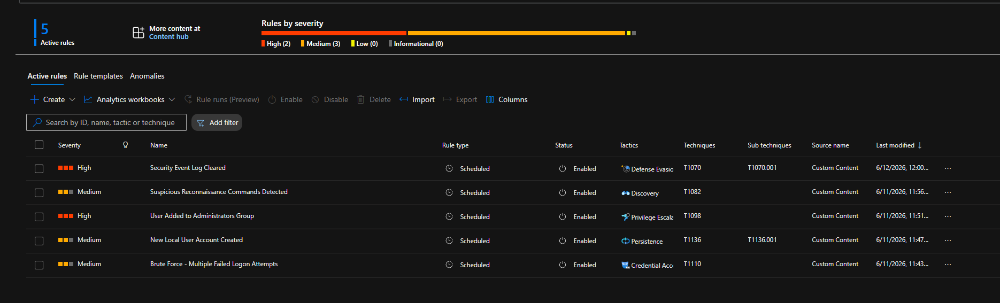
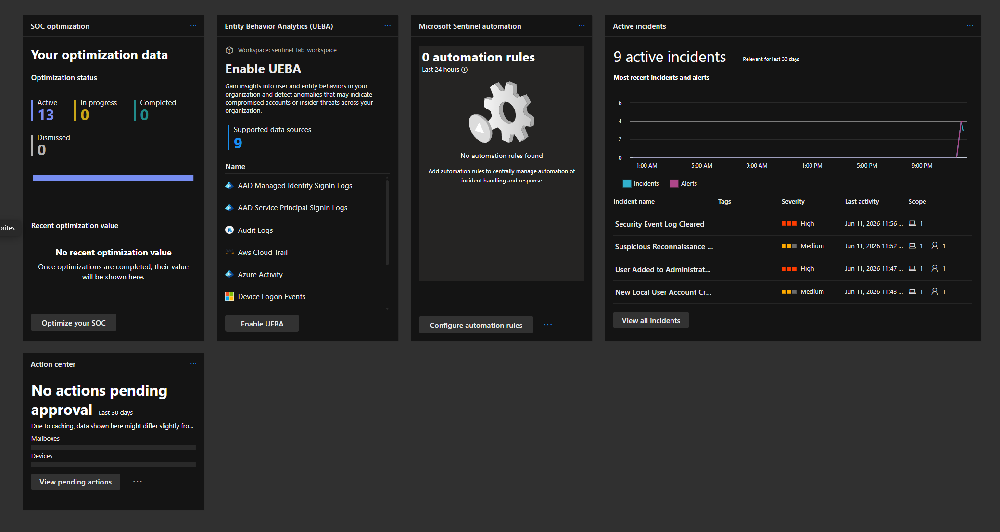
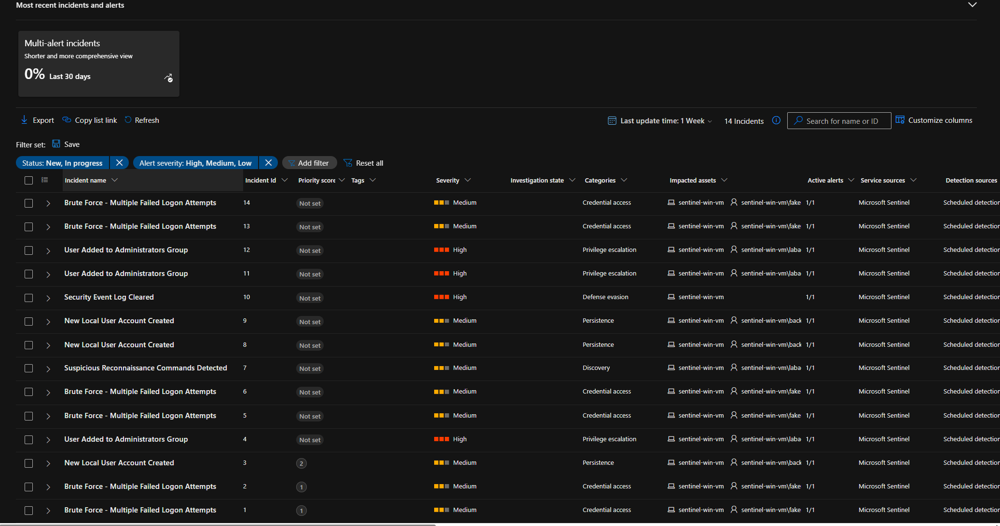
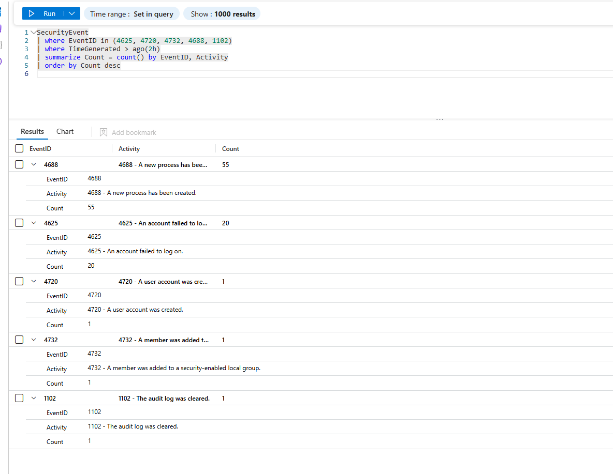
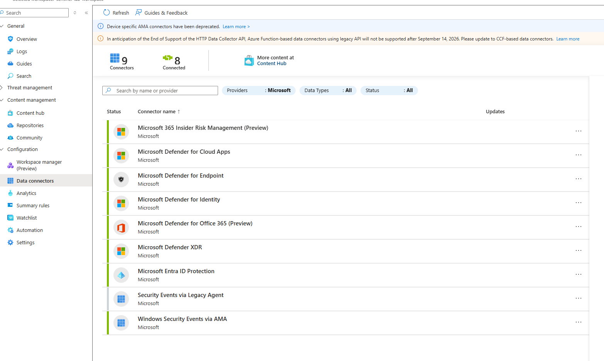

# Microsoft Sentinel Detection Lab

A cloud-based SIEM detection lab built on Microsoft Sentinel, demonstrating end-to-end threat detection across 5 attack techniques. Includes KQL analytics rules, automated incident generation, and IR reports mapped to MITRE ATT&CK.



---

## Lab Overview

| Component | Details |
|---|---|
| **SIEM Platform** | Microsoft Sentinel (Microsoft Defender XDR unified portal) |
| **Log Source** | Windows Security Events via Azure Monitor Agent (AMA) |
| **Target VM** | Windows Server 2022 Datacenter Azure Edition (Standard B2s v2) |
| **Attacks Simulated** | 5 techniques across 5 MITRE ATT&CK tactics |
| **KQL Rules Created** | 5 scheduled analytics rules |
| **Incidents Generated** | 14 incidents across all attack simulations |
| **IR Reports** | 5 structured incident response reports |

---

## Architecture

```
Windows Server 2022 VM (Azure, West US 2)
        │
        │ Azure Monitor Agent (AMA)
        │ Windows Security Events
        ▼
Log Analytics Workspace (East US)
        │
        ▼
Microsoft Sentinel
        │
        ├── Analytics Rules (5 KQL rules)
        ├── Incidents (auto-generated)
        └── Investigation & IR Reports
```

---

## Attacks Simulated & Detections

| # | Attack | Event ID | MITRE Technique | Severity | IR Report |
|---|---|---|---|---|---|
| 1 | Brute Force - 20 Failed Logon Attempts | 4625 | T1110 - Brute Force | Medium | [IR-001](ir-reports/IR-001-Brute-Force-Failed-Logons.md) |
| 2 | New Local User Account Created | 4720 | T1136.001 - Local Account | Medium | [IR-002](ir-reports/IR-002-New-Local-User-Created.md) |
| 3 | User Added to Administrators Group | 4732 | T1098 - Account Manipulation | High | [IR-003](ir-reports/IR-003-User-Added-to-Administrators.md) |
| 4 | Suspicious Reconnaissance Commands | 4688 | T1082 - System Info Discovery | Medium | [IR-004](ir-reports/IR-004-Suspicious-Reconnaissance-Commands.md) |
| 5 | Security Event Log Cleared | 1102 | T1070.001 - Clear Event Logs | High | [IR-005](ir-reports/IR-005-Security-Log-Cleared.md) |

---

## KQL Detection Rules

### 1. Brute Force - Multiple Failed Logon Attempts
```kql
SecurityEvent
| where EventID == 4625
| where TimeGenerated > ago(30m)
| summarize FailedAttempts = count() by Account, IpAddress, Computer, bin(TimeGenerated, 30m)
| where FailedAttempts > 5
```

### 2. New Local User Account Created
```kql
SecurityEvent
| where EventID == 4720
| where TimeGenerated > ago(1h)
| project TimeGenerated, Account, TargetAccount, Computer, EventID
```

### 3. User Added to Administrators Group
```kql
SecurityEvent
| where EventID == 4732
| where TargetUserName == "Administrators"
| where TimeGenerated > ago(1h)
| project TimeGenerated, Account, TargetAccount, TargetUserName, Computer
```

### 4. Suspicious Reconnaissance Commands
```kql
SecurityEvent
| where EventID == 4688
| where TimeGenerated > ago(1h)
| where CommandLine has_any ("whoami", "net user", "net localgroup", "ipconfig", "systeminfo")
| project TimeGenerated, Account, Computer, CommandLine, NewProcessName
```

### 5. Security Event Log Cleared
```kql
SecurityEvent
| where EventID == 1102
| where TimeGenerated > ago(1h)
| project TimeGenerated, Account, Computer, Activity
```

---

## Screenshots

### Sentinel Overview - Active Incidents Dashboard


### Analytics Rules - All 5 Rules Active


### Incidents - 14 Incidents Generated


### KQL Detection Results - All Event IDs Confirmed


### Data Connectors - Windows Security Events via AMA


---

## MITRE ATT&CK Coverage


Navigator layer file: [mitre-navigator-layer.json](mitre-navigator-layer.json)

| Tactic | Technique | Sub-technique |
|---|---|---|
| Credential Access | T1110 - Brute Force | T1110.001 - Password Guessing |
| Persistence | T1136 - Create Account | T1136.001 - Local Account |
| Privilege Escalation | T1098 - Account Manipulation | — |
| Discovery | T1082 - System Information Discovery | — |
| Discovery | T1033 - System Owner/User Discovery | — |
| Discovery | T1087 - Account Discovery | T1087.001 - Local Account |
| Defense Evasion | T1070 - Indicator Removal | T1070.001 - Clear Windows Event Logs |

---

## Incident Response Reports

| Report | Technique | Severity |
|---|---|---|
| [IR-001 - Brute Force Failed Logons](ir-reports/IR-001-Brute-Force-Failed-Logons.md) | T1110 | Medium |
| [IR-002 - New Local User Created](ir-reports/IR-002-New-Local-User-Created.md) | T1136.001 | Medium |
| [IR-003 - User Added to Administrators](ir-reports/IR-003-User-Added-to-Administrators.md) | T1098 | High |
| [IR-004 - Suspicious Reconnaissance Commands](ir-reports/IR-004-Suspicious-Reconnaissance-Commands.md) | T1082 | Medium |
| [IR-005 - Security Event Log Cleared](ir-reports/IR-005-Security-Log-Cleared.md) | T1070.001 | High |

Each IR report includes: incident timeline, detection query, investigation findings, response actions, MITRE ATT&CK mapping, and lessons learned.

---

## Lab Setup

### Prerequisites
- Azure free trial account ($200 credit)
- Microsoft Sentinel workspace
- Windows Server 2022 Azure VM

### Data Collection
- Windows Security Events via Azure Monitor Agent (AMA)
- Command line logging enabled via audit policy and registry
- All Security Events forwarded to Log Analytics workspace

### Attack Simulation
All attacks simulated via PowerShell on the target VM:

```powershell
# Attack 1 - Brute Force
1..20 | ForEach-Object {
    $credential = New-Object System.Management.Automation.PSCredential("fakeuser", (ConvertTo-SecureString "wrongpassword" -AsPlainText -Force))
    try { Start-Process cmd -Credential $credential -ErrorAction Stop } catch {}
}

# Attack 2 - New Local User
New-LocalUser -Name "backdooruser" -Password (ConvertTo-SecureString "TempPass123!" -AsPlainText -Force)

# Attack 3 - Privilege Escalation
Add-LocalGroupMember -Group "Administrators" -Member "backdooruser"

# Attack 4 - Reconnaissance
whoami; net user; net localgroup administrators; ipconfig /all; systeminfo

# Attack 5 - Log Clearing
wevtutil cl Security
```

---

## Key Findings

1. **Cloud SIEM prevents local log clearing** — Event ID 1102 was captured by Sentinel before the local Security log was wiped, demonstrating that AMA-based ingestion makes local evidence destruction ineffective.

2. **Sub-second reconnaissance detection** — Multiple discovery commands executed within a single second were detected as scripted post-exploitation activity, not legitimate admin work.

3. **Attack chain correlation** — IR-002 (account creation) and IR-003 (privilege escalation) occurring within 4 minutes on the same host represent a complete persistence chain that warrants a single High-severity incident.

---

## Related Projects

- [AD SOC Detection Lab](https://github.com/atharva-acharya/AD-SOC-Detection-Lab) — On-premises Active Directory attack detection lab with 7 AD attacks, KQL rules, and IR reports

---
## SC-200 Exam Objective Coverage

This lab directly covers the following Microsoft SC-200 (Security Operations Analyst) exam objectives:

| Objective                                   | Coverage                                                 |
| ------------------------------------------- | -------------------------------------------------------- |
| Configure Microsoft Sentinel workspace      | Deployed Log Analytics workspace, connected Sentinel     |
| Connect data sources using data connectors  | Windows Security Events via AMA                          |
| Configure analytics rules                   | 5 scheduled KQL analytics rules with entity mapping      |
| Investigate incidents in Microsoft Sentinel | Investigation graph, entity pages, hunting queries       |
| Identify threats using KQL                  | 5 detection queries across multiple MITRE ATT&CK tactics |
| Configure automated responses               | Alert grouping, incident creation settings               |
## Author

**Atharva Acharya**  
MSc Cyber Security Engineering, University of Warwick  
CDSA Certified (HackTheBox, June 2026)  
[GitHub](https://github.com/atharva-acharya) | [LinkedIn](www.linkedin.com/in/atharva-acharya-cyber)
