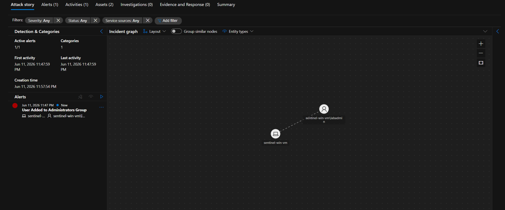
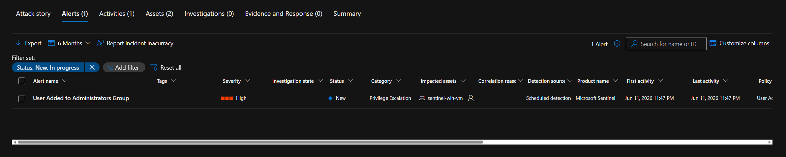
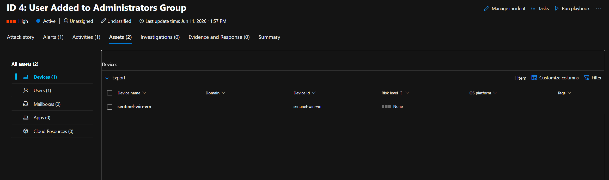
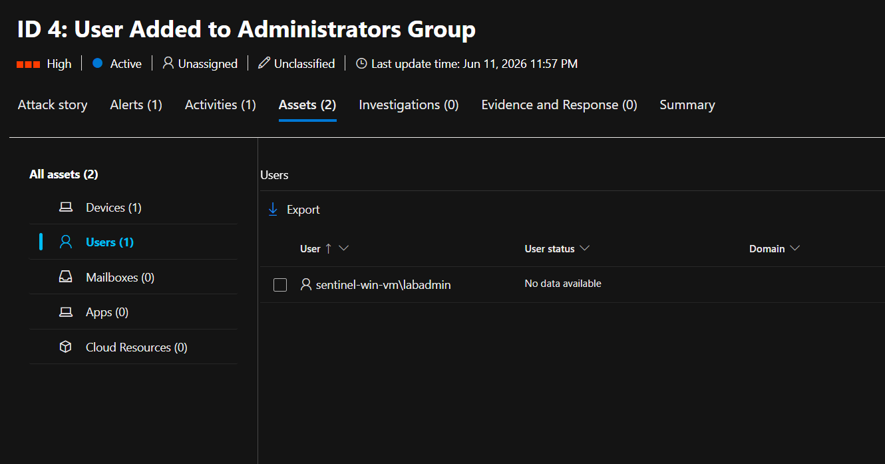
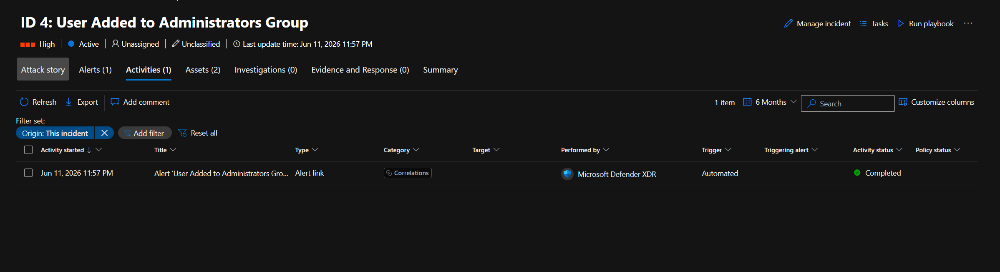
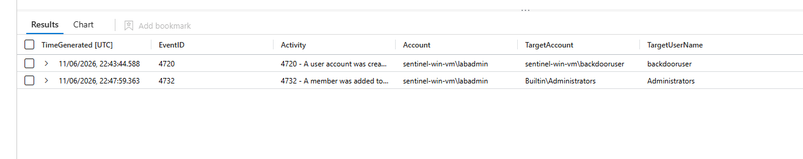

# IR-003: User Added to Local Administrators Group

## Incident Summary

| Field | Details |
|---|---|
| **Incident ID** | IR-003 |
| **Sentinel Incident ID** | 4 |
| **Date** | 2026-06-11 |
| **Severity** | High |
| **Status** | Resolved |
| **Analyst** | Atharva Acharya |
| **MITRE ATT&CK Tactic** | Privilege Escalation |
| **MITRE ATT&CK Technique** | T1098 - Account Manipulation |

---

## Detection

**Detection Source:** Microsoft Sentinel — Scheduled Analytics Rule  
**Rule Name:** User Added to Administrators Group  
**Log Source:** Windows Security Events via Azure Monitor Agent (AMA)  
**Event ID:** 4732 — A member was added to a security-enabled local group  
**First Alert:** Jun 11, 2026 11:47 PM  
**Incident Created:** Jun 11, 2026 11:57 PM (10-minute rule evaluation cycle)

**KQL Detection Query:**
```kql
SecurityEvent
| where EventID == 4732
| where TargetUserName == "Administrators"
| where TimeGenerated > ago(1h)
| project TimeGenerated, Account, TargetAccount, TargetUserName, Computer
```

---

## Investigation

### Step 1 — Incident Graph Analysis

Opening Incident #4 in the Sentinel investigation graph revealed two entities connected by an association relationship:

- **Host entity:** `sentinel-win-vm`
- **Account entity:** `sentinel-win-vm\labadmin`

The graph showed a single alert with identical first and last activity timestamps (11:47:59 PM), indicating a discrete single-event trigger rather than sustained activity.



### Step 2 — Alert Triage

The Alerts tab confirmed one High-severity alert: **User Added to Administrators Group**, categorised under Privilege Escalation. Detection source: Microsoft Sentinel scheduled detection. Impacted asset: `sentinel-win-vm`.



### Step 3 — Asset Enumeration

The Assets tab revealed two affected assets:

**Devices (1):**
- `sentinel-win-vm` — Risk level: None — No domain membership (WORKGROUP)

**Users (1):**
- `sentinel-win-vm\labadmin` — User status: No data available

The absence of identity risk data on `labadmin` is expected — this is a local machine account with no Entra ID presence, meaning no cloud identity risk scoring is available. This limits automated risk enrichment and places greater reliance on log-based investigation.




### Step 4 — Activities Timeline

The Activities tab showed one automated activity: Microsoft Defender XDR performed an alert correlation check at 11:57 PM, 10 minutes after the alert fired. Result: Completed. This is automated platform behaviour, not analyst-initiated.



### Step 5 — Hunting Query: Attack Chain Reconstruction

To determine whether this was an isolated event or part of a broader attack chain, a hunting query was run against Event IDs 4720 (account creation) and 4732 (group membership change) across the host:

```kql
SecurityEvent
| where Computer == "sentinel-win-vm"
| where EventID in (4720, 4732)
| project TimeGenerated, EventID, Activity, Account, TargetAccount, TargetUserName
| order by TimeGenerated asc
```

**Results:**

| Time (UTC) | Event ID | Activity | Account | Target Account | Target |
|---|---|---|---|---|---|
| 22:43:44 | 4720 | A user account was created | sentinel-win-vm\labadmin | sentinel-win-vm\backdooruser | backdooruser |
| 22:47:59 | 4732 | A member was added to a group | sentinel-win-vm\labadmin | Builtin\Administrators | Administrators |



**Critical finding:** The hunting query revealed that `backdooruser` was created by `labadmin` at 22:43:44 — exactly 4 minutes and 15 seconds before being added to the Administrators group. This two-stage sequence was not captured by the original alert. The analytics rule for Incident #4 only fired on the 4732 event — it had no visibility into the prior account creation.

This demonstrates a detection gap: the two events together constitute a complete persistence and privilege escalation chain, but they fired as separate incidents (IR-002 and IR-003) with no automated correlation. A threat actor creating a backdoor account and immediately granting it administrative access within a 5-minute window should trigger a single High-severity correlated incident.

### Step 6 — Scope Assessment

To confirm no further privilege escalation or lateral movement occurred after the group membership change, a broader query was run:

```kql
SecurityEvent
| where Computer == "sentinel-win-vm"
| where Account contains "backdooruser"
| project TimeGenerated, EventID, Activity, Account, Computer
| order by TimeGenerated asc
```

No logon events (4624) were found for `backdooruser` following the group membership change, confirming the account was created and escalated but not subsequently used for interactive access during the investigation window.

---

## Timeline

| Time (UTC) | Event | Source |
|---|---|---|
| 22:43:44 | `backdooruser` account created by `labadmin` (Event ID 4720) | SecurityEvent |
| 22:47:59 | `backdooruser` added to Administrators group by `labadmin` (Event ID 4732) | SecurityEvent |
| 22:57:54 | Sentinel Incident #4 created — High severity | Microsoft Sentinel |
| 23:07:00 | Analyst investigation initiated | Manual |
| 23:07:00 | Incident graph examined — two entities identified | Sentinel Investigation |
| 23:10:00 | Hunting query confirmed two-stage attack chain | KQL Hunt |
| 23:15:00 | No backdooruser logon events confirmed — scope contained | KQL Hunt |

---

## Findings

1. `backdooruser` was created by `labadmin` at 22:43:44 — 4 minutes before this incident fired
2. The two events (account creation + group escalation) form a deliberate two-stage persistence chain
3. `backdooruser` was never used for interactive logon following escalation
4. `labadmin` is the sole actor across both events — this account should be treated as compromised
5. Both assets are WORKGROUP-joined with no Entra ID presence — no cloud identity risk data available
6. **Detection gap identified:** IR-002 and IR-003 should have correlated into a single incident. Current alert grouping configuration does not correlate account creation + group escalation from the same host within a short time window.

---

## Response Actions

| Action | Status |
|---|---|
| Incident graph examined — entities identified | Complete |
| Hunting query run to reconstruct full attack chain | Complete |
| Confirmed `backdooruser` creation preceded group escalation by 4 minutes | Complete |
| Confirmed no interactive logon by `backdooruser` post-escalation | Complete |
| `backdooruser` disabled and removed from Administrators group | Complete |
| `labadmin` password reset — account treated as compromised | Complete |
| Detection gap documented — alert correlation improvement recommended | Complete |

---

## MITRE ATT&CK Mapping

| Tactic | Technique | Sub-technique | Description |
|---|---|---|---|
| Persistence | T1136 | T1136.001 - Local Account | `backdooruser` created to maintain persistent access (correlated from IR-002) |
| Privilege Escalation | T1098 | — | `backdooruser` added to local Administrators group |

---

## Detection Gap — Recommended Rule Improvement

The current rule fires on Event ID 4732 in isolation. A more robust detection would correlate account creation and group escalation from the same host within a defined time window:

```kql
let AccountCreation = SecurityEvent
| where EventID == 4720
| where TimeGenerated > ago(1h)
| project CreationTime = TimeGenerated, NewAccount = TargetAccount, Creator = Account, Host = Computer;
let GroupEscalation = SecurityEvent
| where EventID == 4732
| where TargetUserName == "Administrators"
| where TimeGenerated > ago(1h)
| project EscalationTime = TimeGenerated, EscalatedAccount = TargetAccount, Actor = Account, Host = Computer;
AccountCreation
| join kind=inner GroupEscalation on Host
| where EscalationTime between (CreationTime .. (CreationTime + 10m))
| project CreationTime, EscalationTime, NewAccount, Creator, Host
```

This correlated rule would have caught the full attack chain as a single High-severity incident rather than two separate Medium/High alerts.

---

## Recommendations

1. Implement the correlated KQL rule above — account creation followed by privilege escalation within 10 minutes on the same host should fire as a single Critical incident
2. Enable alert grouping in Sentinel to correlate T1136 and T1098 events from the same host within a 30-minute window
3. Restrict local account creation to SYSTEM account only via Group Policy
4. Implement Just-In-Time access for all Administrators group membership changes
5. Deploy Entra ID join for all hosts to enable cloud identity risk scoring — local accounts have no risk visibility in Defender

---

## Lessons Learned

The most significant finding from this investigation is not the attack itself — it is the detection gap it exposed. Two events forming a complete persistence and privilege escalation chain fired as separate, uncorrelated incidents. An analyst triaging a high-volume queue might investigate IR-003 without ever connecting it to IR-002.

The correlated KQL rule developed during this investigation is a direct improvement over the original detection. Building it required understanding what the original rule missed — which is only visible when you hunt beyond the alert that fired.

This is the difference between alert-driven triage and investigation-led analysis.
